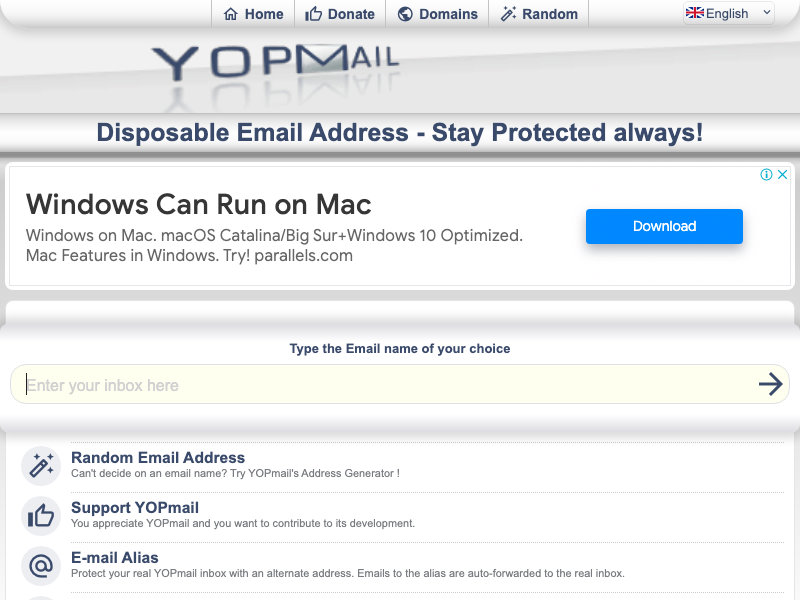
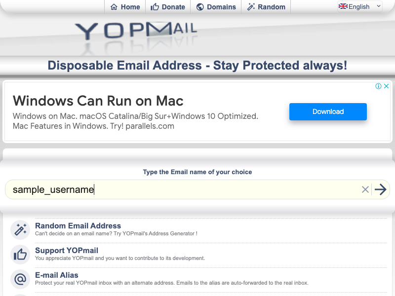

## Puppeteer Experiment for detached sessions

We have created a script to do the following in a headless browser using puppeteer: 

1. Spawn a browser *instance* using `puppeteer.launch()` and store its `wsEndpoint`
2. Go to the URL: [https://yopmail.com/en/](https://yopmail.com/en/)
3. Upon loading the page, take a screenshot of the landing screen.

4. Disconnect from the browser instance.
5. Call `signInUtil` to sign into the website. `wsEndpoint` and `page_index` are passed as params to identify the **browser instance** and **page** after connecting the browser to already launched *instance*. 
6. Fetch the creds from `creds.json` file and enter it into the username field (`div id  = #login`). Capture the screenshot after filling the username.

7. Click on the login button (`div id = #refreshbut`).
8. After navigating to the new page, capture the screenshot again.

9. Disconnect from the browser instance.
10. Log success and close the browser.

